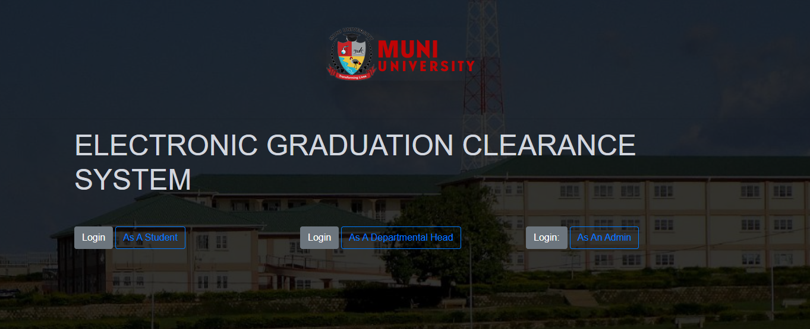
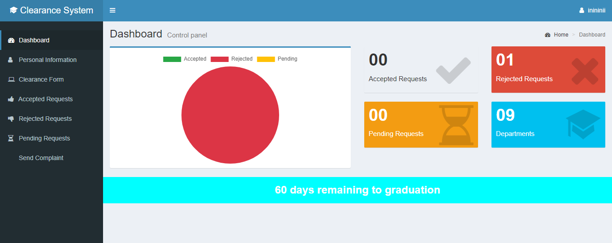
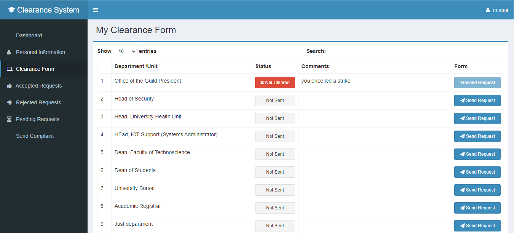

# Electronic Graduation Clearance System (egcs)
 Built on Javascript, PHP, MySQL and Bootstrap --> CASE STUDY (MUNI UNIVERSITY UGANDA)

This system makes it easy for college or university students to clear for graduation without making physical appearance at the university.

When i talk about clearing for graduation. This is a process where all final year students are required to get verified and cleared from different departments of the university before they can graduate. These departments can include the library, computer lab, faculty department and so many others.

Below is the welcome page interface
 

So when the student logs in, they are welcomed with a dashboard having the analytics of their clearance status as seen below

Students can then navigate to different tabs of the system to make clearance requests, see accepted requests, see rejected requests, send complaints to the departments that have delayed to respond to their requests and so many others.
Below is the screenshot for the clearance form

 

